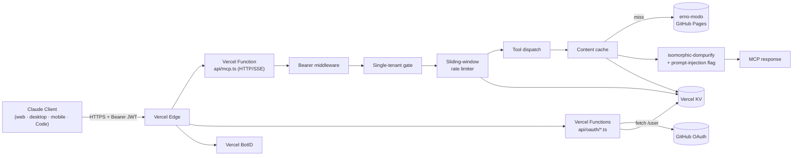
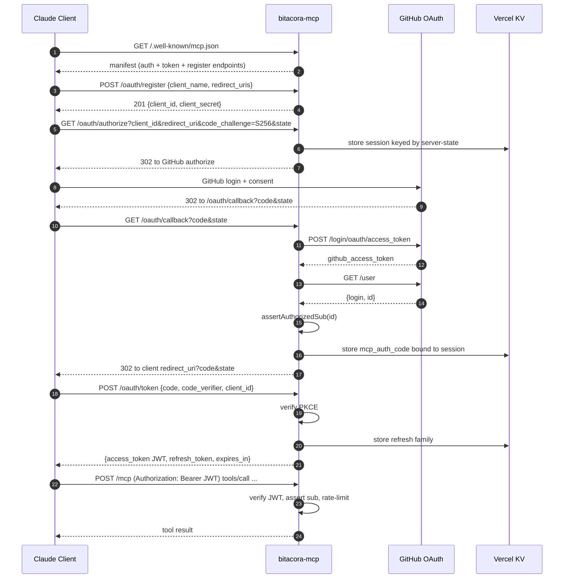

# Design: bitacora-mcp

## Technical Approach

Single Vercel project (`SoyErnoModo/bitacora-mcp`, private) exposing a Remote MCP server over HTTP/SSE on `https://bitacora.konsor.com.ar`. TypeScript + `@modelcontextprotocol/sdk` HTTP transport with a thin OAuth 2.1 authorization-server façade in front of GitHub OAuth. Content is fetched on demand from the erno-modo GitHub Pages site, cached in Vercel KV with a 5-minute TTL, sanitized, and served as MCP tools/resources.

Single-tenant gate is enforced at three layers: (a) `/oauth/callback` rejects GitHub logins other than `SoyErnoModo` before issuing any MCP code; (b) every JWT carries `sub=<github_user_id>` and the bearer middleware compares it against the env-pinned authorized ID; (c) every tool handler re-asserts the same identity from the request context. Defense in depth — one missed check still leaves two more.

Crypto and protocol primitives are delegated entirely to `jose` (JWT) and `oauth4webapi` (PKCE + RFC 7591). No bespoke OAuth or JWT code. Validation uses `zod` schemas at every request boundary.

## Architecture Decisions

### Decision: TypeScript + Vercel Functions over Cloudflare Workers

**Choice**: TypeScript on Vercel Functions (Fluid Compute, Node.js 24 LTS).
**Alternatives considered**: Cloudflare Workers, AWS Lambda, self-hosted Bun.
**Rationale**: Fluid Compute already covers warm-starts and 300s default timeouts. Vercel KV provides the cache + rate-limit substrate without third-party setup. Vercel BotID integrates natively for bot detection. The MODO ecosystem has documented patterns (`promos-hub-site`, `modo-checkout-skill`) using the same stack — institutional knowledge reuse. Cloudflare Workers would force a different KV (Workers KV) and a different bot story; AWS Lambda would add infra overhead unjustified by MVP scope.

### Decision: `@modelcontextprotocol/sdk` HTTP/SSE Transport

**Choice**: Use the official MCP SDK with its HTTP/SSE transport in a Vercel Function.
**Alternatives considered**: Hand-rolled JSON-RPC server, stdio transport with a separate proxy.
**Rationale**: HTTP/SSE is the transport Claude.ai uses for remote connectors. The SDK abstracts framing, session management, and version negotiation. Hand-rolling JSON-RPC for MVP adds bug surface without benefit. stdio transport doesn't apply to cross-device remote connectors.

### Decision: `jose` + `oauth4webapi`, No DIY Crypto

**Choice**: `jose@^5` for JWT issuance/verification, `oauth4webapi@^3` for PKCE primitives and upstream GitHub flow.
**Alternatives considered**: `jsonwebtoken` (legacy, weaker types), `passport-github` (heavy, session-based), hand-rolled HMAC.
**Rationale**: `jose` is the actively maintained TypeScript-first JWT library with constant-time signature verification and proper key management. `oauth4webapi` is a low-level OAuth 2.1 toolkit by the `jose` author — same surface, same security posture. `jsonwebtoken` is in maintenance mode. Anything hand-rolled is a security incident waiting to happen.

### Decision: HS256 with Rotated Secret, Not RS256

**Choice**: JWT access tokens signed with HS256 using a 256-bit secret stored in Vercel env vars. Refresh tokens are opaque random strings, not JWTs.
**Alternatives considered**: RS256 with JWKS endpoint, Ed25519.
**Rationale**: Single-issuer + single-consumer (the server is the only verifier) makes asymmetric crypto unnecessary overhead. HS256 is simpler, faster, and equally secure when the symmetric secret never leaves the server. Refresh tokens are server-side state (rotation requires invalidation lookups) so JWT format buys nothing for them. If multi-issuer or external verifier appears in Fase 2, switch to RS256 with a JWKS endpoint.

### Decision: Vercel KV for Cache, Rate-Limit, and Session State

**Choice**: One Vercel KV namespace for all server-side state: content cache, OAuth session state, refresh token registry, rate-limit windows.
**Alternatives considered**: Separate Upstash Redis, in-memory only, Vercel Postgres.
**Rationale**: KV is Redis-compatible, latency is single-digit ms from Vercel Functions, TTL native, atomic counters native. Postgres adds query overhead unjustified for ephemeral state. In-memory only breaks across cold-instance boundaries and across regions. One KV namespace simplifies ops.

### Decision: `isomorphic-dompurify` for HTML Sanitization

**Choice**: `isomorphic-dompurify` for HTML/SVG sanitization with a custom allowlist; `marked` to convert markdown → HTML when needed; `turndown` for HTML → markdown round-trips.
**Alternatives considered**: `sanitize-html`, custom regex stripping, DOMPurify only.
**Rationale**: `isomorphic-dompurify` works in Node.js + edge runtimes without polyfills, has constant security updates, and supports a strict allowlist mode. `sanitize-html` is also acceptable but `dompurify` is the de facto reference and is what the Cure53 team maintains. Regex stripping is a known-bad pattern (XSS bypasses are infinite).

### Decision: Sliding-Window Rate Limiter via Sorted Sets

**Choice**: Sliding-window rate limit implemented as a sorted set in Vercel KV, keyed by `rl:sub:<sub>:<window>` and `rl:ip:<ip>:<window>`. Each request `ZADD <key> <timestamp> <jti>`; window evaluation `ZCOUNT <key> <now-window_seconds> <now>`. Expire keys after the longest window.
**Alternatives considered**: Token bucket, fixed window, leaky bucket.
**Rationale**: Sliding window is the most predictable for users (no spiky resets), trivial to reason about, and KV operations are atomic. Fixed window has burst behavior at window boundaries. Token bucket needs background refill or per-request recomputation. Sorted sets give us O(log N) operations and built-in TTL.

### Decision: Profile Schema 1.0.0, JSON Schema Validated

**Choice**: `ingest-profile/v1.0.0.json` schema committed to the repo. Server validates its own output against this schema before responding. Downstream consumers (modo-govern PULL adapter) validate inputs against the same file.
**Alternatives considered**: Untyped profile, GraphQL schema, Protobuf.
**Rationale**: JSON Schema is consumable by any language, the ecosystem is mature, and the validation runs in <10ms with `ajv`. GraphQL adds a server-side query layer this MVP doesn't need. Protobuf forces a binary wire format unfit for Claude tool results.

## Data Flow

### OAuth Authorization

```
Claude Client          bitacora-mcp                GitHub OAuth          Vercel KV
     │                        │                          │                    │
     │── GET /.well-known/mcp ─→                         │                    │
     │←─ 200 manifest ─────────│                         │                    │
     │── POST /oauth/register ─→                         │                    │
     │←─ 201 {client_id,_secret}                         │                    │
     │── GET /oauth/authorize ─→ store session ────────────────────────────→ │
     │   ?code_challenge=...   │                         │                    │
     │←── 302 to GitHub ───────│                         │                    │
     │────────────────────────────────────→ /login/oauth/authorize           │
     │                         ←──────────── 302 to /oauth/callback ──────────
     │                         │── POST /login/oauth/access_token ──→         │
     │                         │←── {access_token} ───────────────────│       │
     │                         │── GET /user ────────────────────────→       │
     │                         │←── {login: "SoyErnoModo"} ───────────│       │
     │                         │── assert sub ────────────────────────────→ │
     │                         │── store auth_code ──────────────────────→  │
     │←── 302 to client redirect_uri ?code=...&state=...                     │
     │── POST /oauth/token ────→ verify PKCE + lookup ─────────────────────→ │
     │   {grant_type, code,    │                                              │
     │    code_verifier}       │                                              │
     │←── {access_token JWT,   │── store refresh_token family ────────────→  │
     │    refresh_token}       │                                              │
```

### Tool Invocation

```
Claude Client                                              erno-modo (GitHub Pages)
     │                                                            │
     │── POST /mcp (Bearer JWT) ──→ bearer middleware              │
     │   tools/call read_post              │                       │
     │                                     ↓                       │
     │                            validate sub == AUTHORIZED_SUB   │
     │                                     ↓                       │
     │                            zod validate input               │
     │                                     ↓                       │
     │                            check rate limit ──→ Vercel KV   │
     │                                     ↓                       │
     │                            cache lookup ──→ Vercel KV       │
     │                                     ↓ (miss)                │
     │                            fetch raw content ──────────────→
     │                                     ↓                       │
     │                            sanitize via dompurify           │
     │                                     ↓                       │
     │                            store cache (TTL 300s) ──→ KV    │
     │                                     ↓                       │
     │←── tool result {content, type, source_url, ...} ─────────── │
```

## File Changes

### New repo `SoyErnoModo/bitacora-mcp/`

| File | Action | Description |
|------|--------|-------------|
| `package.json` | Create | Pin `@modelcontextprotocol/sdk@^1`, `jose@^5`, `oauth4webapi@^3`, `zod@^3`, `isomorphic-dompurify@^2`, `marked@^14`, `@vercel/kv@^2`, `botid@latest`. Node `>=22`. |
| `pnpm-lock.yaml` | Create | Locked deps. |
| `tsconfig.json` | Create | Strict TS, `target: "ES2022"`, `module: "NodeNext"`. |
| `vercel.ts` | Create | Vercel config: framework null, regions list, headers (HSTS, CSP, nosniff, Referrer-Policy, Permissions-Policy), redirects http→https. |
| `api/.well-known/mcp.json.ts` | Create | Discovery manifest handler. |
| `api/oauth/register.ts` | Create | RFC 7591 dynamic client registration. |
| `api/oauth/authorize.ts` | Create | Authorization endpoint; persists session, redirects to GitHub. |
| `api/oauth/callback.ts` | Create | GitHub OAuth callback; exchanges code, asserts `sub == AUTHORIZED_SUB`, issues MCP auth code. |
| `api/oauth/token.ts` | Create | Token endpoint; verifies PKCE, issues JWT + refresh token, handles refresh rotation. |
| `api/mcp.ts` | Create | Main MCP HTTP/SSE handler; mounts SDK server, wires tools/resources. |
| `api/internal/cache-invalidate.ts` | Create | Webhook to flush cache keys (HMAC-signed). |
| `lib/auth/jwt.ts` | Create | `signAccessToken`, `verifyAccessToken` over `jose`. |
| `lib/auth/pkce.ts` | Create | PKCE verify via `oauth4webapi`. |
| `lib/auth/github.ts` | Create | GitHub code → access token → user lookup. |
| `lib/auth/refresh-tokens.ts` | Create | Refresh token family management in KV. |
| `lib/auth/sub-gate.ts` | Create | Single-tenant assertion: `assertAuthorizedSub(sub)`. |
| `lib/cache/kv.ts` | Create | Wrapped Vercel KV client with typed methods. |
| `lib/cache/content-cache.ts` | Create | Cache layer for upstream fetches (manifests, posts). |
| `lib/content/fetchers.ts` | Create | `fetchManifest`, `fetchPost` from `https://soyernomodo.github.io/erno-modo/`. |
| `lib/content/sanitize.ts` | Create | Wrapper around `isomorphic-dompurify`; HTML allowlist; prompt-injection pattern detector. |
| `lib/content/markdown.ts` | Create | `marked` + `turndown` round-trips. |
| `lib/mcp/tools/read-post.ts` | Create | `read_post` tool. |
| `lib/mcp/tools/search.ts` | Create | `search` tool. |
| `lib/mcp/tools/list-decks.ts` | Create | `list_decks` tool. |
| `lib/mcp/tools/list-rfcs.ts` | Create | `list_rfcs` tool. |
| `lib/mcp/tools/list-skills.ts` | Create | `list_skills` tool. |
| `lib/mcp/tools/get-ingest-profile.ts` | Create | `get_ingest_profile` tool. |
| `lib/mcp/resources.ts` | Create | Resource roots `bitacora://{decks,rfcs,skills,posts}/`. |
| `lib/mcp/server.ts` | Create | MCP server instance + tool/resource registration. |
| `lib/ratelimit/sliding-window.ts` | Create | Sliding-window rate limiter on KV sorted sets. |
| `lib/botid/middleware.ts` | Create | BotID verification middleware for public endpoints. |
| `lib/schemas/tool-inputs.ts` | Create | `zod` schemas for every tool input. |
| `lib/schemas/profile.ts` | Create | `zod` schema mirroring `ingest-profile/v1.0.0.json`. |
| `lib/schemas/profile.v1.0.0.json` | Create | JSON Schema, single source of truth for the ingest profile shape. |
| `lib/voice/profile-loader.ts` | Create | Loads `voice` + `behavioral_rules` overrides from a committed JSON. |
| `data/owner-profile.json` | Create | Owner-side overrides (display_name, bio, voice, behavioral rules). No secrets. |
| `data/authorized-subs.json` | Create | Single-entry whitelist `{"sub": "<github_user_id>", "login": "SoyErnoModo"}`. |
| `tests/unit/*.test.ts` | Create | Unit tests per module (vitest). |
| `tests/integration/*.test.ts` | Create | OAuth flow + tool invocation against mocked upstreams. |
| `tests/contract/*.test.ts` | Create | Profile shape contract tests against JSON Schema. |
| `.github/workflows/ci.yml` | Create | Lint, typecheck, test, audit, build on PR. |
| `.github/workflows/cd.yml` | Create | Deploy preview on PR, deploy prod on tag. Audit-gate job. Layer 3 CSP validation post-deploy. |
| `.github/workflows/security-audit.yml` | Create | Audit-iterate Security Engineer gate (manual + scheduled). |
| `README.md` | Create | Setup + Claude.ai connector registration instructions. |
| `openspec/changes/bitacora-mcp/pull-adapter-mapping.md` | Create | Mapping ingest-profile fields → modo-govern SPEC-110/111/118 PULL adapter. |
| `openspec/changes/bitacora-mcp/security-audit.md` | Create (later) | Subagent audit findings + verdict. |

### Modifications to `SoyErnoModo/erno-modo/`

| File | Action | Description |
|------|--------|-------------|
| `decks.json`, `rfcs.json`, `skills.json` | Modify (optional) | Enrich entries with `summary`, `tags`, `mcp_metadata` to improve catalog. Backward-compatible — added fields only. |
| `rd/bitacora-mcp.html` | Create | R&D article documenting architecture, OAuth flow, threat model. |

## Interfaces / Contracts

### JWT Access Token Claims

```ts
type AccessTokenClaims = {
  iss: 'https://bitacora.konsor.com.ar';
  sub: string;            // GitHub numeric user ID, never the login
  aud: string;            // client_id of the registered Claude client
  jti: string;            // crypto random, used for rate-limit dedupe and revocation
  iat: number;            // issued-at, epoch seconds
  exp: number;            // iat + 3600 (1 hour)
  scope: string;          // space-separated, MVP: "bitacora.read profile.read"
  client_id: string;      // duplicate of aud for convenience
  github_login: string;   // SoyErnoModo, informational only — auth is on sub
};
```

### Refresh Token Record (KV)

```ts
type RefreshTokenRecord = {
  token: string;          // opaque random, hashed for storage
  family_id: string;      // groups rotations for reuse detection
  sub: string;
  client_id: string;
  scope: string;
  issued_at: number;
  expires_at: number;     // 30 days from issuance
  rotated_to?: string;    // hash of the next refresh token after rotation
  revoked?: boolean;
};
// KV key: rt:<hash(token)>
// KV TTL: matches expires_at
```

### Cache Key Schema

```
cache:manifest:decks:<source-hash>   → JSON, TTL 300s
cache:manifest:rfcs:<source-hash>    → JSON, TTL 300s
cache:manifest:skills:<source-hash>  → JSON, TTL 300s
cache:post:<type>:<slug>             → { content, sanitized, fetched_at }, TTL 300s
cache:source-commit                   → latest erno-modo main SHA, TTL 60s
```

### Rate Limit Keys

```
rl:sub:<sub>:minute  → sorted set of jti by ts. ZADD on request, ZCOUNT in [now-60, now]. TTL 120s.
rl:sub:<sub>:hour    → same shape, window 3600. TTL 3700s.
rl:ip:<ip>:minute    → for unauthenticated endpoints. Window 60. TTL 120s.
```

### OAuth Session Record (KV)

```ts
type AuthorizationSession = {
  state: string;
  client_id: string;
  client_redirect_uri: string;
  client_state: string;
  code_challenge: string;
  code_challenge_method: 'S256';
  scope: string;
  created_at: number;
};
// KV key: oauth:session:<state>
// KV TTL: 600s
```

### MCP Tool Input Schemas (zod sketch)

```ts
export const readPostInput = z.object({
  slug: z.string().regex(/^[a-z0-9][a-z0-9-]*$/i).max(200),
  format: z.enum(['markdown', 'html']).default('markdown').optional(),
});

export const searchInput = z.object({
  query: z.string().min(1).max(200),
  type: z.enum(['deck', 'rfc', 'skill', 'post']).optional(),
  limit: z.number().int().min(1).max(100).default(20).optional(),
});

export const listFilter = z.object({
  filter: z.object({
    tag: z.string().optional(),
    state: z.string().optional(),
    since: z.string().datetime().optional(),
  }).strict().optional(),
});

export const getIngestProfileInput = z.object({
  format: z.enum(['json', 'markdown']).default('json').optional(),
});
```

## Threat Model (STRIDE, abridged)

| # | Threat | Category | Likelihood | Impact | Mitigation |
|---|--------|----------|-----------|--------|------------|
| 1 | Attacker steals a GitHub OAuth `code` and exchanges it for a MCP token | Spoofing | Low | High | PKCE `S256` is required, attacker without the original `code_verifier` cannot complete the exchange. `state` binding ties code to session. |
| 2 | Prompt-injection content makes Claude execute attacker instructions when the user reads a post | Tampering | Med | Med | `isomorphic-dompurify` strips HTML/JS surface. Prompt-injection pattern detector flags `prompt_injection_detected: true` in metadata. Content stays text, not executable. |
| 3 | Refresh token theft enables long-term account takeover | Spoofing + Elevation | Low | High | Refresh rotation with reuse detection (sibling refresh of an already-rotated token revokes the entire family). Tokens hashed at rest. 30-day TTL. |
| 4 | Information disclosure via verbose error responses (leaks secrets, internal paths) | Information Disclosure | Med | Med | Generic error responses to clients (`error`, `error_description`). Detailed errors logged server-side only. Lint rule banning template literals interpolating secrets into Response bodies. |
| 5 | Denial of service via expensive tool invocations or upstream fetch storms | Denial of Service | Med | Med | Per-sub rate limit (60/min, 1000/h). Per-IP rate limit on unauthenticated endpoints. Cache layer collapses repeated upstream fetches. BotID blocks automation on public endpoints. |

Lower-likelihood threats noted but not detailed: CSRF on token endpoint (defended by PKCE + non-cookie auth), session fixation (no shared cookies), tabnabbing (no rendered HTML pages other than minimal consent), supply-chain attack on deps (mitigated by pinned lockfile + audit job in CI).

## Testing Strategy

| Layer | What to Test | Approach |
|-------|--------------|----------|
| Unit | JWT signing/verifying, PKCE verifier match/mismatch, refresh rotation + reuse detection, sub-gate, sanitizer (script tags stripped, JS URIs neutralized, prompt-injection patterns flagged), zod schemas, rate-limit math, cache key construction. | `vitest`, in-process. Mock KV with in-memory map. Mock GitHub fetches with `msw`. |
| Integration | Full OAuth flow happy path, unauthorized GitHub login rejected, PKCE mismatch rejected, refresh rotation, expired token rejected, every tool happy + invalid input + not_found, oversized payload truncation, BotID block on `/oauth/authorize`. | `vitest` running the Vercel Function handlers locally with `@vercel/node`'s test harness. Real KV against `vercel dev`. |
| Contract | `get_ingest_profile` output validates against `lib/schemas/profile.v1.0.0.json`. Discovery manifest validates against MCP spec schema. | `ajv` runs JSON Schema validation on every test response. Failures block CI. |
| E2E | Register Claude.ai custom connector against a preview deployment, complete authorization, list tools, invoke each tool, confirm the GitHub `sub` gate (try logging in as a different GitHub user → rejection). | Manual on staging. Documented in `README.md` runbook. Automated against `vercel dev` is out of scope for MVP. |
| Security | Audit-iterate Security Engineer subagent reviews `lib/auth/*`, `api/oauth/*`, sanitizer, rate-limit. Findings logged in `security-audit.md`. Re-run before every prod promote. | Subagent invocation (separate context). Findings as severity-tagged list. ALLOW verdict required. |

## Migration / Rollout

No data migration. New project, no preexisting users.

Rollout phases:
1. **Preview**: PR-based preview deployments on Vercel. Connector registered against the preview URL for manual smoke testing. No audit gate enforced.
2. **Internal staging**: Merged-to-main deployments to a staging URL (`bitacora-mcp-stg.konsor.com.ar`). Audit-iterate Security Engineer subagent runs against this URL. Findings resolved here.
3. **Production**: Tag-driven promote to `bitacora.konsor.com.ar`. CI requires non-stale ALLOW verdict in `security-audit.md`. Layer 3 CSP validation runs post-deploy and can fail the pipeline.

Rollback: Vercel "Instant Rollback" reverts the production alias to the previous good deployment in seconds. If a security incident requires immediate auth break, rotating the JWT signing secret invalidates every issued token globally.

## Deployment Pipeline Sketch

`.github/workflows/cd.yml` (sketch):

```yaml
name: cd
on:
  push:
    branches: [main]
    tags: ['v*']

jobs:
  preview:
    if: github.ref == 'refs/heads/main'
    runs-on: ubuntu-latest
    steps:
      - uses: actions/checkout@v4
      - uses: actions/setup-node@v4
        with: { node-version: '24' }
      - run: pnpm install --frozen-lockfile
      - run: pnpm test
      - run: vercel deploy --token=$VERCEL_TOKEN --env=staging

  audit-gate:
    if: startsWith(github.ref, 'refs/tags/v')
    runs-on: ubuntu-latest
    steps:
      - uses: actions/checkout@v4
      - name: Check security-audit.md verdict
        run: |
          test -f openspec/changes/bitacora-mcp/security-audit.md
          grep -qE '^Verdict:\s*(ALLOW|PRODUCTION-READY)' \
            openspec/changes/bitacora-mcp/security-audit.md
          # fail if stale (older than 30 days)
          age=$(( ($(date +%s) - $(stat -f %m openspec/changes/bitacora-mcp/security-audit.md)) / 86400 ))
          [ "$age" -le 30 ] || { echo "audit stale ($age days)"; exit 1; }

  prod:
    needs: audit-gate
    if: startsWith(github.ref, 'refs/tags/v')
    runs-on: ubuntu-latest
    steps:
      - uses: actions/checkout@v4
      - run: pnpm install --frozen-lockfile
      - run: pnpm test
      - run: vercel deploy --prod --token=$VERCEL_TOKEN

  validate-csp:
    needs: prod
    if: startsWith(github.ref, 'refs/tags/v')
    runs-on: ubuntu-latest
    steps:
      - uses: actions/checkout@v4
      - name: Layer 3 CSP validation
        run: bash ~/.claude/skills/frontend-security-checklist/reference/cd-validate-csp.sh \
              https://bitacora.konsor.com.ar
```

## Architecture Diagram (Mermaid)



## OAuth Flow Diagram (Mermaid)



## Open Questions

- [x] Dominio canónico — answered: `bitacora.konsor.com.ar`.
- [x] OAuth provider — answered: GitHub only.
- [x] Tenancy MVP — answered: single-tenant.
- [x] Repo visibility — answered: privado.
- [ ] **DNS provider for `konsor.com.ar`** — confirm provider supports CNAME on apex/subdomain and provide credentials path for the CD step that updates DNS, OR confirm manual DNS step is acceptable.
- [ ] **Vercel team scope** — personal account or a team (cost + collaborator implications).
- [ ] **JWT access token TTL** — proposed 3600s (1h). Confirm acceptable for the Claude client UX (re-auth experience on refresh expiry).
- [ ] **Refresh token TTL** — proposed 30 days. Acceptable?
- [ ] **modo-govern PULL adapter schema artifact** — is `SPEC-110` published as a JSON Schema we can validate against, or is the compatibility check documentation-only for MVP? Answer determines whether the contract test is automated or manual.
- [ ] **Cache invalidation webhook signer** — proposed HMAC with a separate `WEBHOOK_SECRET` env. Acceptable, or prefer GitHub-signed webhooks tied to the erno-modo repo?
- [ ] **R&D article timing** — write it before merge of the MCP repo (as design documentation) or after MVP ships (as case study)?
